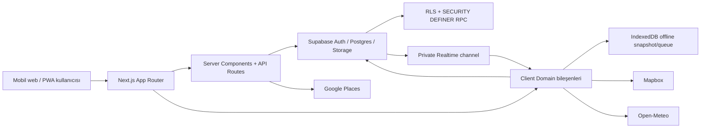
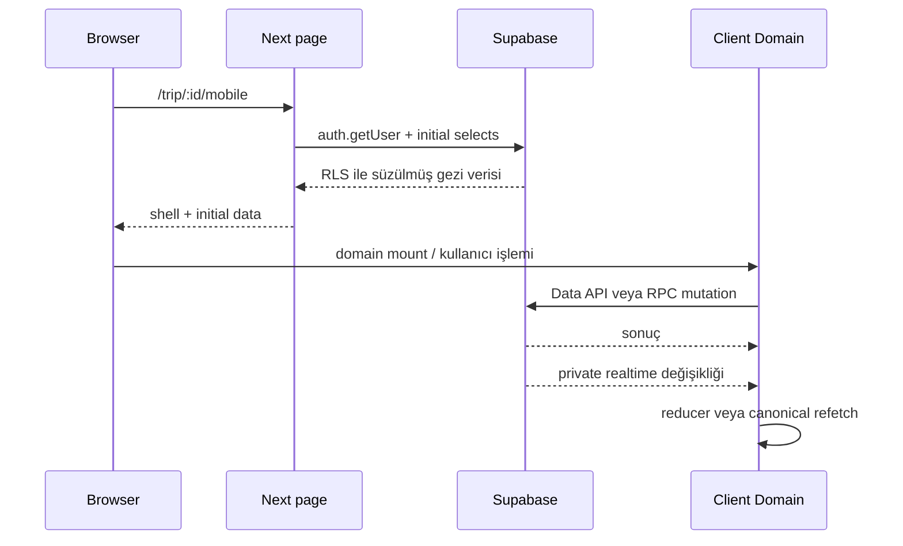
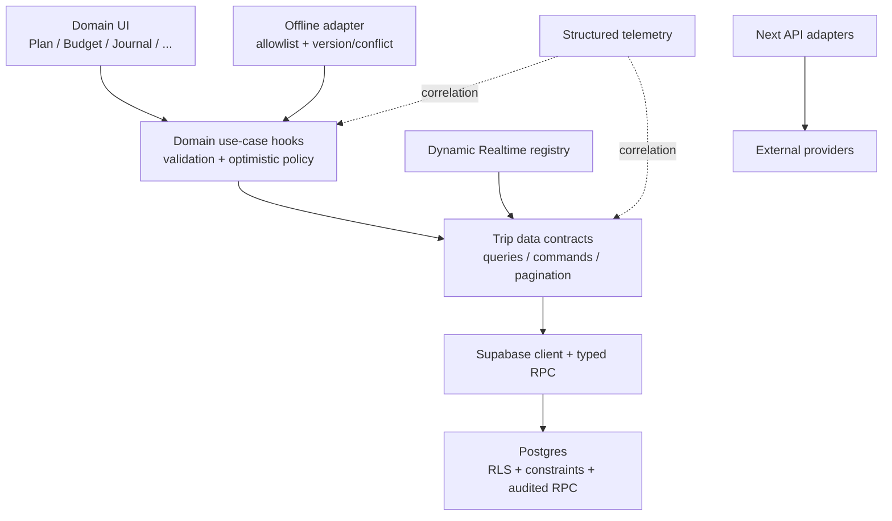

# Tripper Proje Analizi ve Teknik Yol Haritası

## 1. Rapor Bilgileri

| Alan | Değer |
|---|---|
| Rapor tarihi | 2026-07-28 |
| Saat dilimi | America/Los_Angeles |
| İncelenen dal | `main` (`origin/main` ile aynı noktada) |
| İncelenen commit | `5cb5c2f0dbd99904901d6bf537a058aa90294533` — `code improve` |
| Commit tarihi | 2026-07-28T05:50:45-07:00 |
| Çalışma ağacı başlangıç durumu | Projeye ait izlenen dosyalarda değişiklik yoktu; kullanıcıya ait, önceden var olan izlenmeyen `.claude/settings.local.json` dosyasına dokunulmadı. |
| İnceleme yaklaşımı | Statik kaynak/doküman/SQL incelemesi, güvenli yerel lint ve test çalıştırması, paket ağacı ve Git meta verisi kontrolü |
| İzin verilen değişiklik | Yalnızca bu rapor |

Önem dereceleri:

- **Kritik:** Güvenlik olayı, veri kaybı veya ciddi üretim kesintisi riski.
- **Yüksek:** Yakın zamanda önemli hata, performans ya da bakım sorunu oluşturabilir.
- **Orta:** Geliştirme hızını veya güvenilirliği düzenli etkiler.
- **Düşük:** Yararlı iyileştirme sağlar, ancak acil değildir.

Bu rapordaki satır numaraları incelenen commit için geçerlidir. `TestLogin.md` içindeki hassas değerler güvenlik nedeniyle bu raporda tekrarlanmamıştır.

## 2. Yönetici Özeti

Tripper; yolculuk oluşturma, rota ve günlük planlama, rezervasyon, ortak bütçe, hazırlık listesi, seyahat günlüğü, gerçek zamanlı iş birliği ve çevrimdışı erişimi tek bir mobil öncelikli web uygulamasında birleştiren, işlevsel açıdan ileri bir ürün prototipidir. Uygulama, Next.js App Router üzerinde çalışan bir **modüler monolit** ve Supabase’in Auth, Postgres, RLS, Storage ve Realtime servislerine dayanan istemci-ağırlıklı bir veri erişim modeli kullanır.

Mevcut yaklaşımın tamamen yeniden yazılması gerekmiyor. Domain tabanlı ekran ayrımı, RLS’yi gerçek güvenlik sınırı olarak kabul etme, para değerlerinde minor-unit kullanımı, atomik RPC’ler, özel Storage bucket’ları, güvenli yönlendirme, harici istek timeout’ları ve çevrimdışı veri sınırları korunmalıdır. Buna karşılık güvenlik, migration disiplini, otomasyon, veri bütünlüğü ve büyüyen domain bileşenlerinin ayrıştırılması aşamalı biçimde iyileştirilmelidir.

En acil sonuçlar:

1. **Kritik — izlenen dosyada düz metin kimlik bilgisi:** `TestLogin.md:1-2` gerçek görünümlü bir e-posta/parola çifti içeriyor ve dosya `abfd779` commit’inden beri Git geçmişinde. İlgili parola derhal değiştirilmeli, tüm oturumlar iptal edilmeli, dosya ve geçmiş güvenli biçimde temizlenmeli, diğer servislerde yeniden kullanım araştırılmalıdır.
2. **Yüksek — settlement RPC yetkilendirme/bütünlük açığı:** `record_settlement_payment`, çağıranın ilgili geziye üye olduğunu ve tarafların o geziye ait olduğunu zorunlu kılmıyor (`supabase/migrations/20260717020000_settlements.sql:49-100`). Gezi UUID’sini bilen kimliği doğrulanmış bir dış kullanıcı, kendisini taraf göstererek başka geziye sahte ödeme kaydı ekleyebilir.
3. **Yüksek — davet kodu kaba kuvvet riski:** Kodlar farklı akışlarda yaklaşık 32–40 bit entropiye sahip; `join_trip_by_invite` için uygulama/veritabanı düzeyinde hız sınırlama veya deneme kaydı yok (`000_full_schema.sql:15-27`, `012_trip_members_authorization.sql:109-139`, `20260717230803_trip_collaboration.sql:319-352`).
4. **Yüksek — şema gerçeği ve dağıtım güveni:** Migration’lar SQL Editor’da elle uygulanıyor, iki alternatif başlangıç şeması var ve kontrol betiği yalnızca bazı nesnelerin varlığını kontrol ediyor (`docs/app-flow-overview.md:70-84`, `scripts/check-pending-migrations.sql:1-30`). Kod, depo ve canlı veritabanı kolayca ayrışabilir.
5. **Yüksek — kalite kapısı yok:** CI/CD tanımı bulunmuyor. Yerel lint geçti; 184 testin 182’si geçti, 2’si başarısız oldu. Güvenlik SQL dosyaları işlevsel rol senaryolarını otomatik çalıştırmıyor.

Olgunluk değerlendirmesi: **özellik kapsamı yüksek, üretim mühendisliği olgunluğu erken-orta seviye**. Ürün yönü anlaşılır; fakat gerçek üretim güveni için secret müdahalesi, migration gerçeği, CI, işlevsel RLS testleri, gözlemlenebilirlik, yedek/geri dönüş doğrulaması ve sınırlı veri sorguları şarttır.

Önerilen ilk hareket sırası: kimlik bilgisini etkisizleştir → canlı şema ve erişim loglarını denetle → settlement ve davet akışlarını kapat → işlevsel güvenlik testlerini ekle → CI kalite kapısını kur.

## 3. Analiz Kapsamı ve Sınırlamalar

### İncelenen kapsam

- 303 izlenen dosya; yaklaşık 258 kaynak, SQL, test ve dokümantasyon dosyasında yaklaşık 35.500 satır.
- `README.md`, `AGENTS.md`, `.env.example`, uygulama akış ve mevcut mobil baseline belgeleri.
- `app/`, `components/`, `lib/`, `types/`, `public/`, `scripts/`, `tests/`, `supabase/migrations/` ve yapılandırma dosyaları.
- Next.js sayfaları/API route’ları, Supabase istemci/sunucu/admin istemcileri, RLS ve `SECURITY DEFINER` fonksiyonları.
- PWA/service worker, IndexedDB snapshot ve mutation queue tasarımı.
- `package.json`, `package-lock.json`, TypeScript, ESLint ve Next.js yapılandırması.
- Git dalı, commit ve çalışma ağacı durumu.

### Çalıştırılan güvenli kontroller

| Kontrol | Sonuç |
|---|---|
| `npm run lint` | Başarılı |
| `npm test` | 184 test: 182 başarılı, 2 başarısız |
| Yerel paket ağacı (`npm ls --depth=0`) | Komut başarılı; `@emnapi/runtime@1.11.2` “extraneous” |
| Kaynakta secret paterni taraması | İzlenen `TestLogin.md` bulgusu doğrulandı |

### Bilinçli olarak çalıştırılmayan kontroller

- **Build çalıştırılmadı:** `.next` çıktısını değiştirir.
- **Ayrı TypeScript kontrolü çalıştırılmadı:** `incremental` ayarı nedeniyle build-info üretebilir/değiştirebilir.
- **Migration veya SQL testi çalıştırılmadı:** canlı/yerel veritabanını değiştirme riski ve bağlı bir disposable Supabase ortamı olmaması.
- **Bağımlılık audit’i ve sürüm güncelliği sorgulanmadı:** dış ağ ve güncel zafiyet verisi gerektirir.
- **Tarayıcı E2E/manual QA yapılmadı:** üretim benzeri servis ve test hesabı kullanımı değişiklik/işlem üretirdi.

### Sınırlamalar

- **Doğrulanamadı:** canlı Supabase şeması, migration geçmişi, RLS’nin canlı tanımı, veritabanı rolleri/grant’leri, Advisor bulguları, indeks kullanım istatistikleri ve `EXPLAIN ANALYZE`.
- **Doğrulanamadı:** production deployment platformu, header’lar, cookie özellikleri, rate limit’ler, loglar, alarmlar, trafik, maliyet, SLA, backup/PITR ve restore testleri.
- **Doğrulanamadı:** `TestLogin.md` içindeki kimlik bilgisinin hâlâ geçerli veya başka yerde yeniden kullanılmış olması. Geçerli olmadığı kanıtlanana kadar sızmış kabul edilmelidir.
- **Doğrulanamadı:** güncel CVE/supply-chain durumu. Buradaki paket değerlendirmesi yerel lockfile ve kullanım üzerindendir.
- `.env.local` değerleri okunup raporlanmadı; yalnızca değişken adlarının kodla uyumu kontrol edildi.
- Performans bulguları profil/telemetri değil, sorgu ve veri akışı üzerinden yapılan risk analizidir. İndeks önerileri ölçüm sonrası kesinleştirilmelidir.

## 4. Projenin Amacı ve Mevcut Durumu

### Problem ve hedef kullanıcı

Tripper, birden fazla kişinin katıldığı yol gezilerinde parçalı çalışan harita, not, rezervasyon, hesap paylaşımı, yapılacaklar ve fotoğraf uygulamalarının yarattığı koordinasyon sorununu çözüyor. Birincil hedef kullanıcılar:

- Arkadaşları veya ailesiyle karayolu gezisi planlayan mobil kullanıcılar.
- Bir geziyi yöneten sahip/editörler ve salt okuma yapan katılımcılar.
- Seyahat sırasında düşük bağlantıda planına erişmek isteyen kullanıcılar.

### Temel kullanım senaryoları

- Kullanıcı adı/parola veya Google OAuth ile oturum açma.
- Ülke, tarih ve duraklarla gezi oluşturma; davet koduyla katılımcı ekleme.
- Durakları sürükleyerek sıralama, rota hesaplama ve günlük itinerary oluşturma.
- Google Places ile mekân keşfi ve plana ekleme.
- Rezervasyon ve özel ek dosya saklama.
- Masraf, split ve settlement hesaplama.
- Packing/task hazırlığı; canlı aktivite/yorumlar.
- Gezi olayları, günlük ve fotoğraflarla recap.
- Seçilen geziyi cihazda çevrimdışı saklama ve bağlantı geldiğinde izinli değişiklikleri eşitleme.

### Mevcut olgunluk

- **Ürün kapsamı:** yüksek; ana gezi yaşam döngüsü büyük ölçüde mevcut.
- **Mimari:** anlaşılır modüler monolit; domain’ler belirgin fakat bazı dosyalar aşırı büyümüş.
- **Güvenlik niyeti:** güçlü; RLS, özel bucket ve kontrollü RPC kullanımı var. Ancak iki somut yetkilendirme/secret açığı acil.
- **Test:** saf iş mantığında iyi başlangıç; gerçek veritabanı, E2E ve CI katmanları eksik.
- **Operasyon:** erken; otomatik migration/CI, alarm ve restore kanıtı yok.

### Doküman–davranış farkları

- README’nin auth bölümü Google OAuth olmadığını söylüyor; login ekranı ve callback akışı Google OAuth sunuyor (`README.md:116-124`, `app/(auth)/login/page.tsx:45-56,131-136`).
- `.env.example`, README ve kodun istediği Supabase değişkenlerini içermiyor; sadece harita/Places değişkenlerini içeriyor (`.env.example:1-12`, `README.md:23-37`, `lib/supabase/server.ts:6-10`).
- `docs/current-mobile-baseline.md` bazı dosya boyutları ve realtime tablo sayıları bakımından güncel kodun gerisinde; belge kendisini baseline olarak tanımlasa da hızlı evrim nedeniyle tarih/status etiketi gerektiriyor.
- `scripts/check-pending-migrations.sql` adı tüm migration’ları kontrol ediyormuş izlenimi veriyor, ancak yalnızca son özelliklerin küçük bir alt kümesini ve varlık seviyesini kontrol ediyor (`scripts/check-pending-migrations.sql:14-29`).

Ürünün yönü kod ve dokümandan anlaşılabiliyor. Açık olmayan bölüm, önümüzdeki 3–6 ayda hedefin tüketici ürünü doğrulaması mı, kapalı beta güvenilirliği mi, yoksa ölçek büyütme mi olduğudur.

## 5. Teknoloji Envanteri

| Alan | Teknoloji | Projedeki rolü ve kanıt |
|---|---|---|
| Dil | TypeScript, TSX, SQL, CSS, service-worker JavaScript | Uygulama, UI, iş mantığı, migration/RLS ve PWA (`app/`, `lib/`, `supabase/migrations/`, `public/sw.js`) |
| Runtime/framework | Node.js, Next.js 16.2.10 App Router, React 19.2.7 | SSR/server component sayfaları, route handler’lar, client domain’leri (`package.json`, `app/layout.tsx`) |
| Paket yönetimi | npm, lockfile v3 | Tekrarlanabilir kurulum (`package-lock.json`) |
| UI | Tailwind CSS 3.4, Radix UI, Framer Motion, dnd-kit, Lucide | Stil, erişilebilir primitive, animasyon, sürükle-bırak, ikonlar |
| Harita | Mapbox GL/react-map-gl; Google Maps JS | Rota/harita ve Explore harita katmanları (`lib/mapbox/`, `components/map/`, `components/explore/GoogleExploreMap.tsx`) |
| Veri/Auth | Supabase JS + SSR; Postgres | Auth, Data API, RLS, RPC, Realtime ve Storage (`lib/supabase/`, `supabase/migrations/`) |
| ORM | Yok | Supabase query builder ve SQL RPC; üretilmiş/elle yönetilen TypeScript modelleri |
| API | Next route handlers, Supabase Data API/RPC | Signup/account delete ve Places proxy’leri (`app/api/`) |
| State | React local state/context, module-level domain cache, local/session storage, IndexedDB | Global state framework’ü yok; domain sahipliği korunuyor |
| Cache | Next/client module cache, service-worker public static cache, IndexedDB private snapshot | `public/sw.js`, `lib/offline/`, çeşitli `*Domain.tsx` cache map’leri |
| Queue | Tarayıcı IndexedDB mutation/media queue | Offline değişikliklerin tekrar denenmesi (`lib/offline/sync.ts`) |
| Scheduler/background | Gerçek sunucu job altyapısı yok; SW Background Sync yalnız açık istemciyi uyandırıyor | `public/sw.js:105-109`, `components/pwa/RegisterSW.tsx:47-49` |
| Storage | Supabase private buckets | Rezervasyon eki, makbuz, günlük fotoğrafı; kısa ömürlü signed URL |
| Harici API | Google Places New, Mapbox Geocoding/Directions/Optimization/Static Images, Open-Meteo | `app/api/places/`, `lib/mapbox/`, `lib/weather/openMeteo.ts` |
| Analytics | Vercel Analytics | Localhost dışındaki istemcilerde açılıyor (`components/analytics/ProductionAnalytics.tsx:6-16`) |
| Log/izleme | Yapılandırılmış sınırlı `console.error/warn`; error tracking/tracing yok | `lib/supabase/server-errors.ts:30-54` |
| Test | Node test runner, TypeScript/ESM kaynak-contract testleri, manuel SQL assertion dosyaları | `tests/`, `package.json` |
| Build/lint | Next build, TypeScript strict, ESLint | `package.json`, `tsconfig.json`, `eslint.config.mjs` |
| CI/CD | Depoda tanım yok | `.github/workflows`, GitLab CI, Dockerfile, `vercel.json` yok |
| Deployment | Muhtemelen Vercel + Supabase | Vercel Analytics ve Next yapısından çıkarım; **Doğrulanamadı** |
| Container/cloud config | Yok | Yerel `.claude/launch.json` yalnız `npm run dev` çalıştırıyor |

Tip güvenliği `strict: true` ile iyi bir tabana sahip; `skipLibCheck` ve `allowJs` geçiş kolaylığı sağlıyor. Paket `type: module` tanımı olmadığı için testlerde tekrarlanan `MODULE_TYPELESS_PACKAGE_JSON` uyarıları oluşuyor.

## 6. Klasör Yapısı ve Önemli Dosyalar

| Yol | Sorumluluk |
|---|---|
| `app/` | App Router sayfaları, server component veri yükleme, API route’ları ve gezi domain ekranları |
| `app/trip/[id]/mobile/` | Gezi çalışma alanı: shell, Overview/Plan/Explore/Bookings/Prep/Budget/Journal/Travel domain’leri |
| `components/` | Paylaşılan UI, haritalar, onboarding, auth, PWA ve gezi oluşturma bileşenleri |
| `lib/` | Supabase istemcileri, realtime, offline, harita/Places, validasyon ve saf iş mantığı |
| `supabase/migrations/` | Şema, RLS, grant, storage policy ve RPC geçmişi |
| `tests/` | Node tabanlı unit/static contract testleri ve manuel SQL güvenlik assertion’ları |
| `docs/` | Akış, baseline, migration handoff, realtime ve QA belgeleri |
| `public/` | Manifest, ikonlar ve production service worker |
| `types/` | Uygulama veri tipleri |
| `scripts/` | Elle çalıştırılan migration varlık kontrolü |

Başlangıç noktaları:

- HTML/root composition: `app/layout.tsx:22-55`.
- Route/session yenileme: `proxy.ts`.
- Authenticated trip server load: `app/trip/[id]/mobile/page.tsx:45-150`.
- Client workspace shell: `app/trip/[id]/mobile/TripMobileClient.tsx`.
- Merkezi realtime: `lib/supabase/trip-realtime.tsx`.
- Veri güvenlik sınırı: migration’lardaki RLS ve RPC’ler.

Bakım açısından en sıcak dosyalar: `PlanRouteDomain.tsx` (827 satır), `JournalDomain.tsx` (782), `ReservationEditorSheet.tsx` (775), `JourneyScene.tsx` (773), `TripOverviewDomain.tsx` (696) ve `ItineraryTimeline.tsx` (609). Bunlar yalnız render değil; veri alma, optimistic state, mutation, upload, realtime ve hata yönetimini birlikte taşıyor.

Sahipsiz/eski olabilecek varlıklar:

- `docs/dusk-migration-handoff.md` ve `docs/trip-page-dusk-migration-handoff.md` geçmiş teslim belgeleri; silinmeden `docs/archive/` altında tarih/durum etiketiyle tutulmalı.
- `html/New Trip Step *.dc.html`, ekran PNG’leri ve tasarım prompt’ları README’de referans artefact olarak açıklanıyor; aktif kaynakla karıştırılmayacak dizine alınmalı.
- İki başlangıç şeması (`000_full_schema.sql`, `001_initial_schema.sql`) yeni geliştirici ve ortam kurulumu için belirsizlik yaratıyor.
- `TestLogin.md` doküman değil, kritik secret sızıntısıdır; derhal etkisizleştirilmelidir.

İsimlendirme domain düzeyinde tutarlı; ancak shell altında hem büyük `*Domain.tsx` dosyaları hem de alt klasörler bulunması, veri sahipliği konvansiyonu yazılı olmadığı için yeni geliştiricinin “sorgu nerede yaşamalı?” sorusunu zorlaştırır.

## 7. Sistem Mimarisi

### Yüksek seviye

### Mevcut yaklaşım

Server component sayfalar `auth.getUser()` ile kimliği doğrulayıp ilk veriyi çeker. Etkileşimli domain’ler bundan sonra Supabase’e doğrudan istemciden sorgu/mutation gönderir. Bu nedenle UI’daki `canEdit` kontrolleri yalnız kullanıcı deneyimidir; gerçek tenant sınırı RLS/RPC’dir. Bu karar `docs/current-mobile-baseline.md:5` ve `lib/trip-capabilities.ts` ile açıkça kabul edilmiştir.

### Mimari değerlendirme

**Korunmalı**

- Modüler monolit ve domain tabanlı ekran ayrımı.
- Server-first kimlik doğrulama/ilk veri yükleme.
- RLS’yi güvenlik sınırı kabul eden model.
- Karmaşık çoklu yazımlarda RPC/transaction; para için integer minor-unit.
- Merkezi private realtime channel, reconnect’te canonical resync.
- Harici provider’ları küçük `lib/` adaptörleri ve Next proxy’leri arkasına alma.
- Offline özelliğinin opt-in/progressive enhancement olması.

**Aşamalı değişmeli**

- Domain içindeki sorgu, mutation, realtime ve render sorumlulukları küçük repository/query hook/use-case katmanlarına ayrılmalı.
- Tüm tabloları baştan dinleyen realtime yerine aktif domain tabanlı abonelik/refcount uygulanmalı.
- Module-level cache’ler ortak query contract’ına dönüştürülmeli; yeni bir global state ürünü zorunlu değil.
- RLS/RPC contract’ları disposable Supabase ortamında çalıştırılan işlevsel testlerle güvenceye alınmalı.
- Veri büyüdükçe full-select/full-refetch yerine keyset pagination ve delta güncelleme kullanılmalı.

Yüksek bağlılık en çok büyük domain bileşenlerinde; düşük bütünlük ise sorgu/realtime/hata kalıplarının domain’ler arasında tekrarında görülüyor. Buna rağmen microservice veya kapsamlı state yönetimi dönüşümü için kanıt yoktur.

## 8. Temel Çalışma Akışları

### Kayıt ve giriş

1. Signup formu `/api/auth/sign-up` route’una gider.
2. Route JSON’u doğrular, service-role admin istemciyle sentetik e-posta üzerinden kullanıcı yaratır ve username metadata/profil akışına güvenir (`app/api/auth/sign-up/route.ts:5-49`).
3. Login, Supabase istemcisine doğrudan parola ile oturum isteği veya Google OAuth başlatır (`app/(auth)/login/page.tsx:45-56`).
4. Callback güvenli `next` yolunu `lib/safe-redirect.ts:1-15` ile sınırlar.

Hata akışları genel olarak kullanıcıya kontrollü mesaj verir; ancak signup client fetch/JSON çağrısında dış `try/catch` bulunmadığı için ağ hatasında loading durumu takılabilir (`app/(auth)/sign-up/page.tsx:33-51`). Parola kurtarma akışı bulunamadı; sentetik e-posta modeli nedeniyle standart e-posta recovery’nin nasıl işleyeceği açık değildir.

### Gezi oluşturma ve katılma

- Wizard istemci validasyonunu `lib/trip-validation.ts` ile yapar; son adım `create_trip_with_stops` RPC’sini çağırır (`components/trips/new/Step5.tsx:40-71`).
- RPC gezi, owner üyeliği ve durakları tek transaction içinde yaratır.
- Katılma sayfası kodu `join_trip_by_invite` RPC’sine verir; RPC eşleşmede `editor` üyeliği ekler (`012_trip_members_authorization.sql:109-139`).
- RLS erişimi sınırlar; fakat davet denemesi hız limiti/audit olmadan kısa token uzayını tarar.

### Gezi çalışma alanı

- Server sayfa gerekli gezi/üye/durak verisini ve opsiyonel domain verilerini paralel çeker; zorunlu sorgu hataları ile opsiyonel özellik eksikliklerini ayırır (`app/trip/[id]/mobile/page.tsx:45-150`, `lib/supabase/server-errors.ts`).
- RLS nedeniyle erişilemeyen gezi 404 olur.
- `TripMobileClient` domain’leri lazy yükler, navigasyonu ve üyelik yenilemeyi yönetir; üyeliği 30 saniyede bir kontrol ederek yetki iptal penceresini daraltır (`TripMobileClient.tsx:173-179`).
- Domain mutation’ları optimistic state uygular; Postgres Changes ve private delete signal ile diğer istemciler güncellenir.

### Bütçe/settlement

- Gider ve split kaydı `save_expense_with_splits` RPC’siyle tutarlı yazılmaya çalışılır.
- Settlement `record_settlement_payment` RPC’si ve idempotency key kullanır.
- **Kırılma noktası:** RPC çağıran/iki taraf/gezi üyeliği bağını tam doğrulamaz. RLS insert kapalı olsa bile `SECURITY DEFINER` fonksiyon bu sınırı aşar.

### Dosya yükleme

- İstemci MIME/boyut kontrolü yapar, private bucket’a yükler, metadata tablosuna yazar.
- Signed URL kullanıcı eyleminde üretilir ve yaklaşık beş dakika yaşar.
- Metadata/RLS, uploader ve trip membership ile sınırlandırılmıştır.
- Journal yükleme akışında kısmi hata halinde Storage temizliği/rollback mantığı güçlüdür (`JournalDomain.tsx:390-455` civarı).

### Places ve harici servisler

- Authenticated Next API route, kullanıcı/IP anahtarı ile bellek içi limit uygular, girdiyi sınırlar, server-only key ve field mask ile Google’a 8 saniye timeout’lu istek yapar (`app/api/places/`, `lib/google-places/client.ts:12-28`).
- Fotoğraf proxy’si HTTPS ve `googleusercontent.com` hostname son ekini doğrulayarak SSRF yüzeyini daraltır.
- Open-Meteo istekleri başarısızsa sessizce `null` döndürür, ancak timeout ve response schema kütüphanesi yoktur (`lib/weather/openMeteo.ts:33-60`).

### Offline

- Kullanıcı geziyi açıkça indirir; private snapshot kullanıcı+gezi anahtarıyla IndexedDB’ye yazılır.
- Queue payload’ı entity/action allowlist’inden geçirilir ve retry/backoff uygular.
- Hesap değişimi/signout tüm private offline veriyi ve Tripper cache’lerini temizler (`RegisterSW.tsx:26-45`, `lib/offline/db.ts:84-106`).
- SW navigation/account cevabını cache’lemez; yalnız public static asset cache’ler (`public/sw.js:51-103`).
- Background Sync, uygulama kapalıyken kendi başına mutation yapmaz; yalnız açık client’a mesaj gönderir (`public/sw.js:105-109`).

## 9. Kod Kalitesi

### Güçlü taraflar

- TypeScript strict, açıklayıcı domain tipleri ve saf helper fonksiyonları.
- Hata durumlarında optimistic state rollback ve kullanıcı toast’ları yaygın.
- Harici isteklerde abort/stale request kontrolü (`lib/mapbox/directions.ts`, `GooglePlacesExplorer.tsx:73-126`).
- Güvenli yönlendirme, kontrollü server query error metadata’sı ve hassas detayları loglamama.
- Para ve tarih/rota iş mantığının önemli kısmı test edilebilir saf modüllerde.

### Bulgular

| Önem | Bulgu | Kanıt / etki | Öneri |
|---|---|---|---|
| Yüksek | Büyük domain bileşenleri birden çok sorumluluk taşıyor | `PlanRouteDomain.tsx`, `JournalDomain.tsx`, `ReservationEditorSheet.tsx`, `TripOverviewDomain.tsx` | UI, query, mutation/use-case ve upload state’i davranış koruyan küçük adımlarla ayır |
| Orta | Sorgu/realtime/cache kalıpları tekrarlı | Budget, Prep, Bookings, Journal domain’lerindeki ayrı full-load/refetch akışları | Tipli trip repository/query hooks; önce tek domain pilotu |
| Orta | Veri doğrulama istemci/RPC/tablo arasında tutarsız | Wizard doğrular; doğrudan Data API/offline insert DB CHECK’lerini atlayabilir | Kritik invariant’ları DB constraint/RPC’ye taşı |
| Orta | Sessiz `catch` kullanımı tanılamayı azaltıyor | `RegisterSW.tsx:52-54`, `openMeteo.ts:48-49`, çeşitli UI handler’ları | Beklenen progressive failure ile gerçek hatayı ayır; sampling’li telemetry |
| Orta | Ortam dokümanı eksik | `.env.example` Supabase değişkenlerini içermiyor | Çalışan config contract’ı ve startup validation |
| Orta | Machine-specific dev config | `next.config.mjs` içinde `10.0.0.226` | Opt-in env tabanlı development origin |
| Düşük | ESM uyarı gürültüsü | Her testte `MODULE_TYPELESS_PACKAGE_JSON` | Test girişlerini `.mts`/build stratejisiyle standardize et veya kontrollü `"type"` geçişi yap |
| Düşük | Yerel paket ağacı lockfile’dan sapmış | `@emnapi/runtime` extraneous | Temiz `npm ci` ortamında doğrula; yerel `node_modules`’ı kaynak kabul etme |

Belirgin TODO/FIXME yoğunluğu yok. Bu olumlu olmakla birlikte tarihli handoff belgeleri fiilî teknik borç listesinin yerini tutmamalıdır.

`next/font` kullanımı (`app/layout.tsx:1-20`) build zamanında font varlıklarını optimize eder; recap canvas ayrıca runtime FontFace yükler. İki akış kasıtlı görünse de dokümanda sınırı netleştirilmelidir.

## 10. Güvenlik

### Güvenlik bulguları

| ID / önem | Risk, alan ve etki | İhtimal | Önerilen çözüm | Doğrulama |
|---|---|---|---|---|
| SEC-001 **Kritik** | `TestLogin.md:1-2` izlenen dosyada düz metin giriş bilgisi içeriyor; Git geçmişinde `abfd779` commit’inden beri var. Hesap ele geçirme ve parola yeniden kullanımıyla yatay yayılma mümkün. | Yüksek; repo erişimi olan herkes değeri görebilir. Geçerlilik **Doğrulanamadı**. | Parolayı ve yeniden kullanıldığı tüm sırları hemen döndür; global session revoke; auth/audit loglarını incele; dosyayı kaldır; koordineli `git filter-repo`/BFG ile geçmişi temizle ve tüm klonların yenilenmesini iste; secret scanning/pre-commit/CI ekle. | Eski kimlik bilgisiyle giriş başarısız; tüm session’lar kapalı; Git object/history taraması değeri bulmuyor; provider loglarında kötüye kullanım incelemesi tamam. |
| SEC-002 **Yüksek** | `record_settlement_payment`, çağıranın gezi üyesi ve `p_from_member`/`p_to_member` taraflarının aynı geziye ait olduğunu doğrulamıyor (`20260717020000_settlements.sql:49-94`). Authenticated dış kullanıcı bildiği trip UUID’ye sahte kayıt ekleyebilir; finans verisi bozulur. | Orta-yüksek | RPC içinde aktif `is_trip_member(p_trip_id)`; iki tarafın üyelik kontrolü; izin politikasını açıkça tanımla; borç bakiyesini lock edip tutarı doğrula/sınırla; boş `search_path`, tam nitelikli nesneler. `reopen_settlement` için eski üye kuralını da tanımla. | Owner/editor/viewer/outsider/revoked ve çapraz-gezi taraflarıyla transaction rollback’li işlevsel SQL testleri. |
| SEC-003 **Yüksek** | Davet kodları 8 karakter; bazı akışlar hex (~32 bit), biri 32 karakter alfabe (~40 bit). Authenticated join RPC’de hız limiti/audit yok (`000_full_schema.sql:24`, `012...:109-139`, `20260717230803...:319-345`). Başarılı tahmin editor erişimi verir. | Orta; trafik ve kod sızıntısına bağlı | En az 128 bit kriptografik token, mümkünse hash-at-rest; kullanıcı/IP/device bazlı paylaşımlı rate limit; başarısız deneme audit/alert; rotasyonda eski token kesin geçersiz. | Entropi/property testi; paralel brute-force testi 429/lockout üretir; rotate sonrası eski kod reddedilir. |
| SEC-004 **Yüksek** | Public signup service-role `createUser` kullanıyor; uygulama rate limit/bot koruması yok, minimum parola 6, “username taken” hesabı enumerate ediyor (`app/api/auth/sign-up/route.ts:5-49`). Kaynak tüketimi ve hesap kötüye kullanımı. | Orta-yüksek | Shared rate limiter, trusted client-IP çözümleme, bot/abuse kontrolü, Supabase ile uyumlu güçlü parola politikası, bilinçli enumeration kararı, güvenlik olayı logu. | Dağıtık/çok instance yük testi; aynı kullanıcı/IP limit testi; kullanıcı deneyimi ve generic cevap testi. |
| SEC-005 **Orta** | In-memory Places limiti instance başına sıfırlanır; ham `x-forwarded-for` anahtara girer (`lib/google-places/rate-limit.ts:3-18`, `auth.ts:4-9`). Serverless yatay ölçek veya spoof edilen header kotayı aşabilir. | Orta | Managed/shared limiter; yalnız platformun güvenilir proxy header’ı; user-first quota; provider maliyet alarmı. | Çok instance yük testi ve forged header senaryosu. |
| SEC-006 **Orta** | Cross-trip FK/invariant eksikleri: giderin payer/itinerary bağlantısı ve rezervasyonun itinerary’si aynı geziye zorlanmıyor (`20260717010000_expense_splits.sql:100-170`, reservations migration). İki gezi editörü tenant’lar arası ilişki kurabilir. | Orta | Composite FK veya deferred trigger/RPC doğrulaması; write’ları tutarlı use-case üzerinden geçir. | İki ayrı gezi fixture’ıyla cross-link insert/update reddedilir. |
| SEC-007 **Orta** | CSP, HSTS, Referrer-Policy, Permissions-Policy gibi explicit header’lar depoda yok (`next.config.mjs`). XSS sink’i bulunmadı; bu defense-in-depth bulgusudur. Platform header’ları **Doğrulanamadı**. | Orta | Önce üretim header envanteri; Mapbox/Google/Supabase uyumlu CSP Report-Only; sonra enforce; diğer header’ları Next config/platformda tanımla. | Header scanner ve CSP violation telemetry; kritik akış E2E. |
| SEC-008 **Orta** | Private offline snapshot gezi/üye/itinerary/masraf/günlük içeriğini IndexedDB’de şifrelemeden saklar (`lib/offline/types.ts:18-39`, `db.ts:19-26`). Paylaşılan/kilitlenmemiş cihaz profili veriyi açığa çıkarabilir. | Düşük-orta; cihaz tehdit modeline bağlı | Opt-in uyarıyı koru; isteğe bağlı süre sonu/auto-clear/app lock; hassas alan dışlama listesini test et. Tarayıcı içi anahtarın gerçek tehdidi çözüp çözmediğini değerlendirmeden “şifreleme” ekleme. | Snapshot alan allowlist testi; logout/account-switch temizliği E2E; tehdit modeli onayı. |
| SEC-009 **Düşük** | Offline checksum FNV-benzeri ve kriptografik değil (`lib/offline/types.ts:118-135`). Bozulma kontrolü için uygun, güvenlik bütünlüğü sağlamaz. | Düşük | Adını/yorumunu “corruption checksum” olarak netleştir; güven kararında kullanma. | Değiştirilmiş snapshot’ın güvenlik yetkisi vermediğini test et. |
| SEC-010 **Orta** | Birçok `SECURITY DEFINER` fonksiyon `search_path = public` kullanıyor; modern migration’ların bir kısmı boş path kullanıyor. Public schema CREATE grant’i **Doğrulanamadı** (`expense_splits.sql:90-91`, `settlements.sql:59-60`). | Düşük-orta; grant yapılandırmasına bağlı, kısmen teorik | Boş `search_path`, tam nitelikli nesne, `PUBLIC EXECUTE` revoke ve fonksiyon grant envanteri. | `has_schema_privilege` ve `has_function_privilege` assertion; Supabase security advisor. |

### Diğer güvenlik alanları

- **Auth/session:** Server sayfalar `getUser()` ile JWT’yi sunucuda doğruluyor. Proxy session refresh yapıyor. Cookie özellikleri canlıda doğrulanmadı.
- **Rol/tenant:** Owner/editor/viewer capability UX katmanında; RLS asıl sınır. Collaboration migration direct member mutation’ı geri çekip “son owner” invariant’ını RPC’ye taşımış.
- **Injection/XSS:** `dangerouslySetInnerHTML`, `eval`, command execution veya raw SQL birleştirme bulunmadı. React encoding ve parametreli Supabase/RPC kullanımı güçlü.
- **CSRF:** Account delete POST, auth session yanında özel confirmation header bekliyor (`app/api/account/delete/route.ts:22-36`); same-site cookie davranışı doğrulanmadı. Origin kontrolü defense-in-depth olarak değerlendirilmeli.
- **SSRF:** Google fotoğraf URL’si HTTPS/host allowlist ile korunuyor. Kullanıcı kontrollü genel URL fetch’i bulunmadı.
- **Upload/download:** Private bucket, MIME/boyut allowlist, metadata RLS ve kısa signed URL doğru yönde. Gerçek dosya signature/malware taraması risk profiline göre eklenebilir.
- **Log:** Server error helper schema/detail/hint gibi hassas Supabase detaylarını loglamıyor (`lib/supabase/server-errors.ts:30-54`).
- **Webhook:** Webhook bulunmadı; doğrulama ihtiyacı yok.
- **Supply chain:** lockfile mevcut. Güncel CVE durumu doğrulanmadı.
- **Recovery:** Forgot-password/account recovery akışı bulunmadı. Sentetik e-posta modelinin güvenli kurtarma yaklaşımı açık ürün kararı gerektiriyor.

## 11. Performans ve Ölçeklenebilirlik

### Mevcut riskler

1. **Sayfalama olmayan gezi listeleri:** Dashboard ve trips tüm erişilebilir gezileri çeker (`app/dashboard/page.tsx:17-20`, `app/trips/page.tsx:15-18`).
2. **Gezi workspace full-load:** Durak, itinerary, expense, packing, journal ve bazı ilişkiler ilk yüklemede sınırsız alınır (`app/trip/[id]/mobile/page.tsx:45-150`).
3. **Domain full-refetch:** Budget tüm expense/split’leri (`BudgetDomain.tsx:114-130`), Bookings tüm reservation/attachment’ları (`BookingsDomain.tsx:61-67`), Prep tüm packing/task’leri (`PrepDomain.tsx:82-98`), Journal tüm entry/photo’ları (`JournalDomain.tsx:158-164`) yeniler.
4. **Realtime fan-out:** Provider 13 tablo için INSERT ve UPDATE handler’larını en başta kuruyor; aktif olmayan domain’ler için de 26 Postgres Changes handler’ı var (`lib/supabase/trip-realtime.tsx:48,92-121`). Reconnect bütün listener’ların canonical full-refetch’ini tetikler (`:178-182`).
5. **Yorumlar:** Thread sayfalamasız; activity feed ise doğru biçimde 30 kayıtlık keyset pagination kullanıyor (`CollaborationSheets.tsx:109-120,145-147`).
6. **Hava durumu:** Her durak için paralel ayrı istek (`lib/weather/openMeteo.ts:53-60`); timeout yok. Çok durak/provider yavaşlığında kaynak ve bekleme artar.
7. **Places limiter/cache:** Instance-local limiter yatay ölçekte tutarsız; no-store nedeniyle maliyet/latency tamamen provider’a bağlı. Cache yalnız TOS, ürün tazeliği ve ölçüm sonrası düşünülmeli.
8. **Account deletion:** Storage yollarını toplayan, batch silen ve sonra Auth silen cross-service saga; büyük hesapta uzun sürebilir ve yeniden başlatılabilir job değildir (`app/api/account/delete/route.ts`).
9. **Activity retention:** Her anlamlı write trigger’ı expired activity satırlarını siler (`20260717230803_trip_collaboration.sql:190-249`). Yük arttıkça kullanıcı write’larına ek latency/lock bindirir.
10. **Client asset maliyeti:** Mapbox, Google Maps, Framer Motion ve büyük domain bileşenleri bundle riski taşır; domain lazy loading olumlu. Build/bundle analizi çalıştırılmadığı için gerçek boyut **Doğrulanamadı**.

Belirgin klasik N+1 server sorgusu bulunmadı; ilişkili setler çoğunlukla paralel/bulk çekiliyor. Expense/split’i istemcide birleştirmek veri hacmi büyüdüğünde N+1 yerine “çok büyük iki set” sorununa dönüşebilir.

### İndeks adayları

Canlı query planı olmadan kesin eklenmemeli. En güçlü adaylar:

- `trip_members(user_id, trip_id)` — mevcut PK gezi önce; dashboard user-first sorgular.
- `stops(trip_id, order_index)`.
- `expenses(trip_id, expense_date/created_at)`.
- Packing ve diğer full-list tablolarında gerçek order/filter birleşik indeksleri.

Foreign key oluşturmak PostgreSQL’de referanslayan sütuna otomatik indeks eklemez. Her aday `pg_stat_statements`, tablo kardinalitesi ve `EXPLAIN (ANALYZE, BUFFERS)` ile doğrulanmalıdır.

### Trafik/veri 10 kat arttığında ilk zorlanacak alanlar

1. Full-list ve realtime sonrası full-refetch sorguları.
2. Tüm tablo aboneliklerinin Realtime authorization/fan-out maliyeti.
3. Instance-local Places rate limiter ve provider maliyeti.
4. Activity cleanup’ın kullanıcı transaction’ında çalışması.
5. Gözlemlenebilirlik yokluğu nedeniyle latency/error kök nedeninin teşhis edilememesi.
6. Uzun hesap silme ve medya temizliği işlemleri.
7. Offline snapshot/queue conflict politikasının bazı entity’lerde eksik olması.

Supabase Data API kullanıldığı için uygulamanın doğrudan DB connection pool yönetimi yoktur. Provider kapasitesi/limitleri ve tek bölge gecikmesi doğrulanmalıdır. Supabase, Mapbox ve Google kritik dış bağımlılıklardır; mevcut timeout/fallback’ler kısmi koruma sağlar.

## 12. Veri Modeli ve Veri Bütünlüğü

### Olumlu kararlar

- Gezi sahipliği `trip_members` ile açık; attribution alanlarında account deletion için `ON DELETE SET NULL`.
- Para değerlerinde split/settlement için minor-unit ve idempotency key kullanımı.
- Expense + splits, trip creation ve itinerary reorder gibi çoklu yazımlar RPC transaction’ında.
- Activity audit’i kullanıcı tarafından doğrudan değiştirilemiyor; trigger kaynaklı.
- Özel medya metadata’sı ile Storage object politikaları ilişkilendirilmiş.
- Yeni domain tablolarında sık erişilen trip/tarih alanları için birçok indeks mevcut.

### Bütünlük riskleri

- Base `expenses.amount` için negatif değeri engelleyen DB CHECK görülmedi. Offline sync gideri doğrudan Data API ile insert ediyor (`lib/offline/sync.ts:65-68`), dolayısıyla değiştirilmiş istemci negatif tutar gönderebilir.
- Gezi title/date sıralaması, stop koordinat sınırları, metin uzunlukları gibi wizard validasyonları her doğrudan write yolunda DB’ye taşınmamış.
- `paid_by`, `assigned_to`, `completed_by` gibi profil FK’leri kişinin ilgili gezi üyesi olmasını garanti etmiyor.
- Reservation/expense/itinerary bağlantıları aynı `trip_id` içinde olmaya zorlanmıyor.
- `expense_splits` unique `(expense_id, member_id)` kuralı `member_id IS NULL` olduğunda birden çok eski/silinmiş üye satırına izin verir; settlement projection bu kişileri tek “missing payer” kimliği altında birleştirebilir.
- Bulk reorder bazı alanlarda ayrı update’ler halinde çalışıyor (`PrepDomain.tsx:269` civarı); kısmi başarısızlıkta sıralama atomik değil.
- Offline conflict/base-version kontrolü entity’ler arasında eşit değil; bazı journal/event update’leri son-yazan-kazanır.

### Migration kalitesi

Migration’lar çok sayıda güvenlik yorumu, explicit RLS/grant ve idempotent `if exists`/`if not exists` yaklaşımı içeriyor. Buna karşılık:

- `000_full_schema.sql` ve `001_initial_schema.sql` iki farklı baseline anlatıyor.
- Tarih sıralı migration’lar manuel uygulanıyor; depo sırası canlı uygulama sırasını kanıtlamıyor.
- Kodda eski şema yokmuş gibi fallback branch’leri bulunması drift’i gizleyip test matrisini büyütüyor.
- Pending script fonksiyon body/policy/grant/constraint checksum’ı değil, yalnız bazı tablo/kolon/bucket varlığını ölçüyor.
- Bazı `SECURITY DEFINER` fonksiyonlar `search_path=public`, bazıları güvenli boş path kullanıyor.

### Silme, saklama ve audit

- Account deletion Storage → DB/Auth arasında tek transaction olamaz; kısmi hata açıkça kullanıcıya bildiriliyor fakat idempotent recovery job/audit yok.
- `trip_activity` için 90 günlük süre mevcut; journal, reservation, expense ve offline snapshot için merkezi retention politikası belgelenmemiş.
- Gezi silme kalıcı ve cascade ağırlıklı; arşiv/soft delete yaklaşımı yok. Ürün gereksinimi bilinmeden değiştirilmemeli.
- Finansal settlement değişiklikleri, davet denemeleri, role değişiklikleri ve account deletion sonucu için güvenlik/uyum audit’i güçlendirilmeli.

**Doğrulanamadı:** canlı şema ve migration uygulama durumu. Bu bölüm depo tarafından amaçlanan modeli anlatır.

## 13. Test Stratejisi ve Eksikler

### Mevcut durum

- 21 test dosyasında 184 test bulundu.
- 182 test başarılı, 2 test başarısız.
- Saf hesaplama, route optimizer, offline payload/snapshot, capability, auth redirect ve bazı source contract alanlarında iyi kapsama var.
- Dört SQL assertion dosyası itinerary, reservation, expense/settlement ve trip task RLS nesnelerini denetlemek için yazılmış; otomatik test komutuna bağlı değil.

Başarısız testler:

1. `tests/accessibility-contracts.test.mts:24-34`, combobox işaretlerini artık yalnız orkestratör olan `app/trips/new/NewTripClient.tsx` içinde arıyor. Uygulama `components/trips/new/Step3.tsx:70-126` içine taşınmış ve gerekli `combobox/listbox/option` ile klavye davranışı orada. Bu **kırılgan/stale source-path testi**, doğrulanmış bir erişilebilirlik kusuru değil.
2. `tests/offline-security.test.mts:47-53` `tripper-static-v3` bekliyor. `public/sw.js:6` v4 kullanırken `lib/offline/snapshot.ts:69` hâlâ v3 cache açıyor. Test beklentisi güncellenmeli, fakat iki sürümün aynı anda kullanılması gerçek cache yaşam döngüsü tutarsızlığıdır.

### Eksikler ve öncelik

| Öncelik | Test | İş riski |
|---|---|---|
| P0 | Disposable Supabase üzerinde owner/editor/viewer/outsider/revoked settlement ve invite testleri | Finans verisi ve tenant erişimi |
| P0 | Secret scanning; geçmiş/commit diff taraması | Hesap ele geçirme |
| P1 | Migration from-zero + upgrade + schema checksum testi | Ortam drift’i/üretim kırılması |
| P1 | Signup/login rate-limit ve abuse integration testi | Kaynak tüketimi/brute force |
| P1 | DB invariant testleri: negatif gider, cross-trip FK, member-only assignee | Veri bozulması |
| P1 | Auth → create trip → invite → edit → split/settle E2E smoke | Ana gelir/değer akışı |
| P1 | Private Storage: outsider/revoked signed URL ve upload denial | Hassas dosya izolasyonu |
| P2 | Realtime reconnect/resync ve membership revoke E2E | Çok kullanıcı tutarlılığı |
| P2 | Offline download/logout/switch/conflict E2E | Cihaz mahremiyeti ve veri kaybı |
| P2 | Places provider contract testleri (recorded schema, timeout, 429/5xx) | Dış servis kırılması |

Mock’lar saf provider dönüşümünü test etmek için uygundur; RLS ve Storage güvenliği mock’lanmamalı, gerçek disposable Postgres/Supabase rol bağlamında çalışmalıdır. Source-text assertion’ları hızlı güvenlik ağı olabilir ancak davranış testinin yerine geçmemelidir.

Coverage yüzdesi tek hedef olmamalıdır. Önce “dış kullanıcı settlement yazamaz”, “negatif gider oluşamaz”, “rotate edilmiş invite kullanılamaz” gibi iş invariant’ları ölçülmelidir.

## 14. CI/CD, Operasyon ve Gözlemlenebilirlik

Depoda GitHub Actions/GitLab CI, deployment manifest’i, container, otomatik migration veya release pipeline bulunmadı. Dolayısıyla lint/test/build/migration güvenlik kapıları merge/deploy öncesi zorunlu değil.

### Önerilen minimum pipeline

1. Temiz `npm ci`.
2. Secret scan ve dependency audit raporu.
3. Lint, TypeScript no-emit, unit/static test.
4. Disposable Supabase’i sıfırdan migration et; işlevsel RLS/constraint testlerini çalıştır.
5. Production build ve bundle bütçesi.
6. Preview E2E smoke.
7. Onaylı, tek-yönlü migration deploy; schema migration ledger doğrulaması.
8. Uygulama deploy; smoke/health; gerektiğinde app rollback.

Migration geri dönüşü çoğunlukla “restore/forward-fix” gerektirir; otomatik down migration varsayılmamalıdır. Destructive migration için expand → backfill → dual-read/write gerekiyorsa → contract sırası kullanılmalıdır.

### Operasyon boşlukları

- Health/readiness endpoint’i yok.
- Merkezi error tracking, distributed trace ve ürün/domain metriği yok.
- Vercel Analytics yalnız trafik/istemci analitiği sağlar; server/RPC kök nedenini çözmez.
- Kritik alarm tanımı yok: auth abuse, invite failures, RLS denial anomalisi, 5xx, Places 429/cost, Realtime reconnect, offline conflict, deletion partial failure.
- Backup/PITR/restore politikası ve tatbikat kanıtı depoda yok.
- Incident, deployment, rollback, migration ve data recovery runbook’ları yok.
- Tek env feature flag `GOOGLE_PLACES_REVIEWS_ENABLED`; kontrollü rollout sistemi yok. Şu aşamada yeni platform kurmak yerine birkaç yüksek riskli rollout için basit, sahipli flag contract’ı yeterli.
- Ortam farklılıkları ve secret dağıtımı belgelenmemiş. `.env.example` eksik.

Önerilen ilk gözlemlenebilirlik katmanı: her istekte correlation ID, route/RPC adı ve stabil hata kodu; PII/secret olmayan structured log; client/server error tracking; Supabase sorgu/Realtime ve provider latency metrikleri; deploy sürümü/commit etiketi. Tam OpenTelemetry dönüşümü ihtiyaç ölçülmeden şart değildir.

## 15. Bağımlılık Analizi

Yerel kurulu başlıca sürümler: Next 16.2.10, React 19.2.7, TypeScript 5.9.3, `@supabase/ssr` 0.10.3, `@supabase/supabase-js` 2.105.4, Mapbox GL 3.26, react-map-gl 8.1.1, Tailwind 3.4 ve Framer Motion.

### Değerlendirme

- `package-lock.json` committed; bu güçlü bir supply-chain temelidir.
- `npm ls --depth=0` tüm declared paketleri buldu; yalnız yerel `@emnapi/runtime@1.11.2` extraneous. Temiz CI `npm ci` bunu normalize eder.
- Statik import taramasında açıkça kullanılmayan declared paket saptanmadı. Wrapper/dinamik kullanım nedeniyle otomatik “unused” hükmü verilmemelidir.
- Mapbox ve Google Maps benzer harita işlevleri sunsa da kodda farklı akışlar içindir: Mapbox rota/ana harita; Google Explore. Konsolidasyon ancak maliyet ve ürün gerekçesiyle yapılmalıdır.
- Supabase’e lock-in yüksektir: Auth, RLS, RPC, Storage ve Realtime birlikte kullanılıyor. Şu aşamada değiştirme maliyeti faydadan büyüktür; taşınabilirliği SQL invariant’ları, adaptörler ve export/backup ile yönetmek daha gerçekçidir.
- Mapbox/Google provider bağımlılığı `lib/` adaptörleri ve fallback’lerle kısmen sınırlanmış.
- Next/React sürümleri yeni bir ana platform kombinasyonu; değişiklik öncesi release note/uyumluluk doğrulaması gerekir.

**Doğrulanamadı:** paketlerin bugün için en güncel sürümü ve CVE durumu. Ağ tabanlı audit yapılmadan “güncelle” kararı verilmemelidir. Önce CI’da read-only audit/SBOM üretimi, sonra doğrudan ve transitif risklerin etki alanı değerlendirilmelidir.

## 16. Dokümantasyon ve Geliştirici Deneyimi

### Güçlü taraflar

- README kurulum, temel özellik, env ve auth modelini genişçe anlatıyor.
- `docs/app-flow-overview.md` repo, akış, veri modeli ve harita provider ayrımında iyi bir başlangıç haritası.
- `docs/current-mobile-baseline.md`, realtime stratejisi ve mobil regression checklist’i önemli bağlam sağlıyor.
- Karmaşık kodda “neden” yorumları ve güvenlik niyeti genellikle açık.

### Eksikler/drift

- `TestLogin.md` kritik secret sızıntısı ve doküman yönetimi ihlalidir.
- `.env.example`, Supabase URL/publishable/service-role contract’ını içermiyor; README ile çelişiyor.
- README Google OAuth davranışını yanlış anlatıyor.
- Katkı rehberi, CODEOWNERS/modül sahipliği, ADR, güvenlik politikası ve release/deployment rehberi yok.
- API contract/OpenAPI veya en azından route hata kodları tablosu yok.
- Migration ledger ve “hangi baseline?” kararı yok.
- Troubleshooting, incident, backup/restore ve account-deletion recovery runbook’ı yok.
- Handoff/tasarım prompt dosyaları aktif onboarding dokümanlarıyla aynı seviyede.

Önerilen belgeler:

- `CONTRIBUTING.md`: kurulum, safe commands, branch/PR, test katmanları, definition of done.
- `SECURITY.md`: raporlama, secret olayı, supported versions, sorumlu açıklama.
- `docs/architecture/adr-001-modular-monolith.md`: sınırlar, RLS güvenlik modeli, client/server veri erişimi.
- `docs/database/migration-runbook.md`: tek baseline, local/preview/prod apply, ledger, rollback/forward-fix.
- `docs/operations/deployment-runbook.md`, `incident-response.md`, `backup-restore.md`.
- `docs/api/routes.md`: auth/Places/account route’ları, auth, rate limit, stabil hata kodları.
- `docs/configuration.md`: tüm env’ler, server/public sınıfı, owner, zorunlu/opsiyonel, rotation.
- `CODEOWNERS` veya `docs/ownership.md`: auth, database/security, offline, maps ve domain sahipleri.

Yeni geliştiricinin en büyük engelleri canlı şema ile repo farkı, iki baseline, fallback branch’leri, büyük domain dosyaları ve deploy/test otomasyonunun olmamasıdır.

## 17. Güçlü Yönler

- RLS’nin UI kontrolünden farklı gerçek güvenlik sınırı olduğunun açık kabulü.
- Private bucket, kısa signed URL, MIME/boyut allowlist ve metadata policy yaklaşımı.
- `lib/safe-redirect.ts` ile açık yönlendirmeye karşı merkezi koruma.
- Google Places’ta server-only key, field mask, input limitleri, timeout ve fotoğraf host allowlist’i.
- Trip creation, expense split ve reorder gibi çoklu değişikliklerde transaction/RPC.
- Para hesabında integer minor-unit ve settlement idempotency.
- Server query hatalarında hassas DB detayını kullanıcıya/loga saçmayan stabil metadata.
- Merkezi tek private Realtime channel; reconnect’te canonical server state’e dönme.
- Domain lazy loading; harita isteklerinde abort/stale result kontrolü.
- Offline’da navigation/account cevabını cache’lememe, kullanıcı namespace’i, opt-in uyarısı ve signout/account switch temizliği.
- Saf route, budget, offline ve capability mantığında anlamlı unit test tabanı.
- Activity feed’de keyset pagination örneği; diğer listeler için örnek alınabilir.
- Journal upload’ında kısmi başarısızlık temizliği ve rollback.

Gelecekte referans alınacak modüller: `lib/safe-redirect.ts`, `lib/google-places/`, `lib/supabase/server-errors.ts`, activity keyset sorgusu, journal upload rollback’i ve collaboration migration’daki boş `search_path`/explicit grant yaklaşımı.

## 18. Teknik Borç Envanteri

| ID | Başlık | Kanıt / alan | İş ve teknik etki | İhtimal / önem | Zorluk | Çözüm / bağımlılık | Erteleme sonucu |
|---|---|---|---|---|---|---|---|
| TD-001 | Git’te düz metin kimlik bilgisi | `TestLogin.md:1-2`, commit `abfd779` | Hesap ele geçirme, güven kaybı | Yüksek / **Kritik** | Orta | Rotation + session revoke + history rewrite + secret scan; repo erişim koordinasyonu | Aktif kötüye kullanım ve parola tekrar kullanımı yayılımı |
| TD-002 | Settlement RPC auth/integrity açığı | `20260717020000_settlements.sql:49-100` | Başka gezi finans verisi bozulabilir | Orta-yüksek / **Yüksek** | Orta | Üyelik/taraf/bakiye kontrolü + işlevsel SQL test | Yanlış borç/ödeme, güvenlik olayı |
| TD-003 | Zayıf invite token ve limitsiz join | `000:24`, `012:109-139`, collaboration `319-345` | Yetkisiz editor erişimi | Orta / **Yüksek** | Orta | 128-bit token + shared limiter + audit | Kullanıcı sayısıyla saldırı yüzeyi büyür |
| TD-004 | Manuel migration ve iki baseline | `000`, `001`, app-flow `70-84` | Ortam drift’i, deploy kırılması | Yüksek / **Yüksek** | Yüksek | Tek şema gerçeği, CLI/ledger, CI disposable DB | Her feature daha çok uyumluluk branch’i doğurur |
| TD-005 | CI/CD kalite kapısı yok | Repo yapılandırması | Hatalı/güvensiz commit deploy olabilir | Yüksek / **Yüksek** | Orta | Temiz install, lint/type/test/build, DB security E2E | Regresyonlar manuel yakalanır |
| TD-006 | Signup abuse koruması yok | signup route `5-49` | Sahte hesap, kota/maliyet, enumeration | Orta-yüksek / **Yüksek** | Orta | Shared limiter, stronger policy, audit | Public beta ile maliyet/abuse artar |
| TD-007 | DB invariant eksikleri | core schema, offline sync `65-68` | Negatif gider/cross-trip ilişki | Orta / **Yüksek** | Orta-yüksek | CHECK/composite FK/trigger + veri taraması | Bozuk veri birikimi migration’ı zorlaştırır |
| TD-008 | Sınırsız query/full-refetch | page ve domain sorguları | Latency, Realtime/DB maliyeti | Yüksek / **Yüksek** | Yüksek | Ölçüm, keyset, delta update, aktif subscription | 10x büyümede temel darboğaz |
| TD-009 | İşlevsel RLS testleri yok | `tests/*.sql` manuel/statik | Policy açığı merge’de kaçabilir | Yüksek / **Yüksek** | Orta | Disposable Supabase rol matrisi | Güvenlik niyeti davranışla kanıtlanamaz |
| TD-010 | Gözlemlenebilirlik yok | yalnız Vercel Analytics | Üretim teşhisi/MTTR zayıf | Yüksek / **Orta** | Orta | Structured error/event metrics, alert | Sorunlar kullanıcı bildirimiyle öğrenilir |
| TD-011 | Büyük domain dosyaları | 600–827 satırlık sıcak dosyalar | Değişiklik/inceleme/test maliyeti | Yüksek / **Orta** | Yüksek | Davranış koruyan use-case/query/UI ayrımı | Her özellikte regresyon alanı büyür |
| TD-012 | Cache sürüm tutarsızlığı | `sw.js:6`, snapshot `:69` | Eski cache/orphan ve kırık test | Yüksek / **Orta** | Düşük | Tek sabit/versiyon contract’ı, cleanup testi | Cihazlarda gereksiz veri ve belirsizlik |
| TD-013 | Docs/env/auth drift’i | README, `.env.example`, login | Onboarding ve yanlış config | Yüksek / **Orta** | Düşük | Doküman contract testi veya sahiplik | Kurulum ve olay müdahalesi yavaşlar |
| TD-014 | Backup/restore/rollback kanıtı yok | repo dışı, **Doğrulanamadı** | Veri kaybında toparlanma belirsiz | Bilinmiyor / **Yüksek** | Orta | Provider ayarı denetimi + restore tatbikatı | İlk gerçek olayda RTO/RPO bilinmez |
| TD-015 | Security header baseline yok | `next.config.mjs` | Defense-in-depth eksik | Orta / **Orta** | Düşük-orta | Canlı envanter, CSP report-only, header set | XSS/iframe/referrer etkisi büyür |
| TD-016 | Account deletion saga resumable değil | account delete route | Kısmi silme ve destek yükü | Düşük-orta / **Orta** | Yüksek | Idempotent job/state/audit veya recovery runbook | Büyük hesapta yarım silme |
| TD-017 | Activity cleanup write yolunda | collaboration `190-249` | Transaction latency/lock | Orta / **Orta** | Düşük-orta | Scheduled batch cleanup | Aktivite hacmiyle tüm write’lar etkilenir |
| TD-018 | Offline conflict/retention eşitsiz | `lib/offline/` | Sessiz overwrite/mahremiyet | Orta / **Orta** | Orta-yüksek | Entity conflict matrisi, expiry, E2E | Offline kullanım arttıkça veri anlaşmazlığı |
| TD-019 | Test baseline kırık | iki başarısız test | Sinyal gürültüsü, CI kurulamaz | Yüksek / **Orta** | Düşük | Kaynak-yolu testini davranışa taşı; cache contract düzelt | Ekip gerçek regresyonu görmezden gelir |
| TD-020 | DX/package gürültüsü | ESM uyarısı, extraneous paket | Yerel/CI farkı ve log gürültüsü | Yüksek / **Düşük** | Düşük | Temiz CI, module contract kararı | Küçük ama sürekli sürtünme |

## 19. En Yüksek Riskli Alanlar

1. **Secret olayı (TD-001):** Etkisi doğrudan hesap ele geçirmedir; en önce müdahale edilmelidir. Değerin hâlâ geçerli olmaması riski ortadan kaldırmaz, çünkü geçmişte geçerli olmuş olabilir ve yeniden kullanım bilinmiyor.
2. **Veritabanı güvenlik fonksiyonları (TD-002/003/007/009):** RLS güçlü olsa da `SECURITY DEFINER` hatası sınırı aşar. Settlement somut açık; invite ve cross-trip invariant’lar birlikte tenant güvenini etkiler.
3. **Şema/deploy gerçeği (TD-004/005):** Live DB bilinmeden kodun hangi özelliğinin çalıştığı kesin değil. Elle migration ve CI yokluğu ilk üretim kırılmasının en olası kaynağıdır.
4. **Sınırsız veri + realtime full-refetch (TD-008):** Üretimde veri büyümesinde ilk performans/maliyet sorunu çıkaracak alan; tüm ana domain’leri etkiler.
5. **Gözlemlenebilirlik ve kurtarma boşluğu (TD-010/014/016):** Bir olay olduğunda etkisini, kullanıcılarını ve geri dönüş yolunu hızlı belirlemek mümkün olmayabilir.

Veri kaybı/güvenlik olayına yol açabilecek alanlar: secret, settlement/invite, negatif/cross-trip veri, account deletion saga, doğrulanmamış backup/restore. Yeni özellik geliştirmeyi en fazla yavaşlatanlar: büyük domain’ler, tekrarlı veri erişimi, migration fallback’leri ve CI eksikliği.

Tek kişiye bağımlılık Git’ten kesin ölçülemedi. Ancak manual SQL Editor akışının “proje sahibi” tarafından yürütüldüğünü söyleyen belge (`docs/app-flow-overview.md:72`) operasyonel bus-factor riskine işaret ediyor. En yüksek blast radius dosyaları `TripMobileClient`, `trip-realtime`, büyük domain’ler ve RLS/RPC migration’larıdır.

Henüz doğrulanmayan kritik varsayımlar: production şema/grant’leri, leaked credential geçerliliği/kötüye kullanımı, backup/PITR, platform header/rate limit, gerçek veri kardinalitesi ve ekip kapasitesi.

## 20. Hızlı Kazanımlar

| İş | Fayda / neden düşük efor | Zorluk / risk | Etkilenen alan | Tamamlanma kriteri |
|---|---|---|---|---|
| Leaked credential’ı rotate/revoke | Kod değişikliğinden bağımsız provider işlemi; en yüksek risk azalımı | Düşük; kullanıcı erişimini geçici kesebilir | Auth hesabı, `TestLogin.md`, Git geçmişi | Eski credential/session çalışmaz; olay kaydı var |
| İki test baseline’ını düzelt | Hata nedeni iki lokal contract’ta sınırlı | Düşük; yanlış test gevşetme riski | `accessibility-contracts`, `offline-security`, Step3, SW/snapshot | 184/184 geçer; erişilebilirlik davranışı gerçekten test edilir |
| `.env.example` ve README drift’ini düzelt | Gereken değişkenler kodda zaten net | Düşük; service-role’ü public göstermeme | `.env.example`, README | Temiz ortamda config listesi eksiksiz; secret sınıfları açık |
| Security header envanteri + Report-Only CSP | Uygulama rewrite’ı yok; önce gözlem | Düşük-orta; map kaynaklarını engelleme | Next/platform config | Header testi geçer; CSP violation ölçülür, akış kırılmaz |
| Pending migration script kapsamını dürüstleştir | Mevcut SQL’e checksum/işlev listesi eklemek sınırlı | Düşük | script ve migration docs | “Tüm şema” iddiası yok; grant/policy/function kontrolleri listeli |
| Activity cleanup’ı write trigger’dan ayır | Tek migration bölgesinde lokal değişiklik | Düşük-orta; scheduler ön koşulu | collaboration migration/yeni job | Write trigger delete yapmaz; periyodik batch retention sağlar |
| Test komutundaki module warning’i kaldır | Config/test-loader seviyesinde | Düşük; module resolution regresyonu | `package.json`, test girişleri | Test logunda uyarı yok; sonuç aynı |
| Startup env doğrulaması | Mevcut tek merkezli client factory’lere eklenebilir | Düşük-orta | Supabase/Places/Mapbox config | Eksik env kontrollü, secret sızdırmayan hata verir |

Secret dosyası/geçmiş temizliği teknik olarak daha koordinasyonlu olabilir; **credential rotation ve session revoke** bunun hızlı/acil alt adımıdır. Kaynak değişiklikleri bu rapor kapsamında uygulanmamıştır.

## 21. Önerilen Hedef Mimari

Hedef, Supabase destekli Next.js **modüler monolitin güçlendirilmiş hâlidir**; sıfırdan yeniden yazım veya microservice ayrıştırması önerilmez.

### Sınırlar ve sorumluluklar

- **UI:** render, form state ve kullanıcı geri bildirimi; doğrudan karmaşık çoklu tablo iş kuralı yok.
- **Use-case:** `addExpense`, `recordSettlement`, `saveReservation`, `syncOfflineAction` gibi niyetler; capability yalnız UX, server invariant zorunlu.
- **Query/command contract:** select listesi, pagination cursor, cache key, realtime delta/resync ve hata kodu tek yerde.
- **Database:** tenant üyeliği, cross-trip sahiplik, tutar/tarih/koordinat invariant’ı ve transaction.
- **Realtime:** aktif domain refcount; küçük delta reducer; şüpheli gap/reconnect’te canonical sayfalı resync.
- **Offline:** açık entity/action matrisi, schema/cache sürüm kaynağı, base-version conflict ve retention.
- **Provider adapters:** timeout, rate limit, stabil hata modeli ve telemetry.

### Test, güvenlik ve gözlemlenebilirlik

- Saf use-case unit testleri; gerçek disposable Supabase integration/RLS testleri; az ama yüksek değerli browser E2E.
- Her `SECURITY DEFINER` için çağıran rolü, tenant üyeliği, input ownership, boş search path, explicit grant checklist’i.
- Structured event: route/use-case/RPC, duration, status code, retry, deploy commit; PII ve secret yok.
- Security event’leri: signup/join limit, role/settlement/account-delete değişimi ve anomali alarmı.

### Ölçek ve geçiş

- Önce ölç, sonra en sıcak listelere keyset pagination ve uygun indeks ekle.
- Eski istemci/şema uyumluluğu için expand-contract migration ve kısa süreli açık feature flag kullan.
- Domain refactor’ı davranış testleri sonrası strangler yaklaşımıyla tek tek yap.
- Queue, ayrı worker veya Broadcast mimarisi yalnız ölçülen eşiklerde eklenmeli.

## 22. Aşamalı Teknik Yol Haritası

Her maddede zorluk kişi-gün değil görecelidir.

### Aşama 0 — Acil riskler

#### RM-000 — Secret olay müdahalesi

- **Amaç/gerekçe:** TD-001 hesap ele geçirme riskini kesmek.
- **İşler:** Credential rotation, global revoke, reuse/audit araştırması, dosya kaldırma, koordineli history rewrite, secret scan.
- **Alan:** Auth provider, `TestLogin.md`, Git geçmişi, `SECURITY.md`.
- **Ön koşul/bağımlılık:** Repo ve auth admin yetkisi; TD-001.
- **Paralellik:** Log incelemesi rotation sonrası history hazırlığıyla paralel.
- **Risk/geri dönüş:** History rewrite açık PR/klonları etkiler; önce tag/izinli güvenli backup, iletişim ve force-push planı. Credential rotation geri alınmaz; gerekirse yeni güvenli credential verilir.
- **Zorluk/öncelik:** Orta / **P0**.
- **Fayda:** Aktif saldırı yüzeyi kapanır.
- **Başarı/tamamlanma:** Eski credential/session başarısız; geçmiş taraması temiz; etki değerlendirmesi ve olay kaydı tamam.
- **Doğrulama:** Auth testi, provider audit logu, full-history secret scan.

#### RM-001 — Settlement ve finans invariant’larını kapat

- **Amaç/gerekçe:** Authenticated outsider/cross-trip/bozuk tutar yazımını engellemek.
- **İşler:** Üyelik ve iki taraf doğrulaması; bakiye/tutar kuralı; negatif expense CHECK; empty search path; mevcut veriyi preflight tarama.
- **Alan:** Settlement/expense migration’ları, offline sync, budget tests.
- **Ön koşul/bağımlılık:** Canlı şema snapshot’ı; RM-003.
- **Paralellik:** Test fixture hazırlığı paralel.
- **Risk/geri dönüş:** Mevcut bozuk veri constraint’i engelleyebilir; önce raporla/karantinaya al, expand migration uygula. Sorunda fonksiyonun önceki sürümüne kontrollü dönüş, fakat açık tekrar açılmamalı.
- **Zorluk/öncelik:** Orta / **P0**.
- **Fayda:** Finansal tenant bütünlüğü.
- **Başarı/tamamlanma:** Outsider, revoked ve cross-trip taraf senaryoları reddedilir; geçerli ödeme idempotent çalışır.
- **Doğrulama:** Disposable ve staging rol-matrisi SQL testleri.

#### RM-002 — Güvenli davet token’ı ve abuse koruması

- **Amaç/gerekçe:** Kaba kuvvetle editor erişimini önlemek.
- **İşler:** 128-bit token, rotation/migration, shared rate limit, deneme audit’i ve alarm.
- **Alan:** Invite RPC’leri, join UI/API, migration ve tests.
- **Ön koşul/bağımlılık:** Rate-limit store/platform kararı; RM-004 telemetry.
- **Paralellik:** Token schema ile limiter adapter paralel.
- **Risk/geri dönüş:** Eski linkler bozulabilir; kısa, ölçülen dual-accept penceresi veya sahip kontrollü toplu rotation. Acil riskte eski kodları doğrudan invalidate et.
- **Zorluk/öncelik:** Orta / **P0**.
- **Fayda:** Yetkisiz gezi katılımı riski ciddi düşer.
- **Başarı/tamamlanma:** Eski rotate edilmiş kod reddedilir; dağıtık limit aşımı bloklanır; audit alarmı görünür.
- **Doğrulama:** Entropi/property, concurrency ve role E2E.

#### RM-003 — Canlı şema gerçeğini çıkar

- **Amaç/gerekçe:** Güvenlik düzeltmesini bilinmeyen şemaya uygulamamak.
- **İşler:** Read-only schema/policy/grant/function/extension/bucket dump; migration dosyalarıyla fark raporu; tek baseline kararı; backup/PITR durumunu doğrula.
- **Alan:** Supabase, `scripts/check-pending-migrations.sql`, migration docs.
- **Ön koşul:** Read-only admin erişimi.
- **Paralellik:** RM-000 ile paralel.
- **Risk/geri dönüş:** Salt okunur; değişiklik yok.
- **Zorluk/öncelik:** Orta / **P0**.
- **Fayda:** Güvenli müdahale ve deploy zemini.
- **Başarı/tamamlanma:** İmzalı/tarihli schema diff; her migration için applied/unknown; RPO/RTO gerçeği.
- **Doğrulama:** İkinci kişi incelemesi ve tekrar üretilebilir dump.

### Aşama 1 — İlk iki haftalık sprint

#### RM-010 — Yeşil ve zorunlu CI

- **Amaç/gerekçe:** Her değişiklikte tekrarlanabilir kalite kapısı.
- **İşler:** `npm ci`, secret scan, lint, no-emit typecheck, 184 test, production build; iki kırık testi düzelt.
- **Alan:** CI config, package scripts, iki test/cache contract’ı.
- **Ön koşul:** RM-000 history stratejisi.
- **Bağımlılık/paralellik:** RM-011 ile paralel job.
- **Risk/geri dönüş:** İlk gün false positive; blocking’i basamaklı aç, güvenlik P0 taramasını baştan blocking tut.
- **Zorluk/öncelik:** Orta / **P1**.
- **Fayda:** Regresyon ve secret merge’i engellenir.
- **Başarı/tamamlanma:** Temiz clone’da tek komutla yeşil; required check olmadan merge yok.
- **Doğrulama:** Bilinçli kırık test/secret içeren test PR’ı reddedilir.

#### RM-011 — İşlevsel Supabase güvenlik test harness’i

- **Amaç/gerekçe:** Policy varlığını değil davranışını test etmek.
- **İşler:** Disposable local/preview DB; migration from-zero; owner/editor/viewer/outsider/revoked fixtures; RPC/RLS/Storage testleri.
- **Alan:** migrations, SQL tests, CI.
- **Ön koşul:** RM-003 baseline.
- **Bağımlılık/paralellik:** RM-001/002 testleri buraya bağlanır; CI job’ı paralel.
- **Risk/geri dönüş:** Local Supabase süresi; önce P0 tabloları, sonra genişlet.
- **Zorluk/öncelik:** Orta / **P1**.
- **Fayda:** Tenant sınırı kanıtlanır.
- **Başarı/tamamlanma:** P0 rol matrisi otomatik ve rollback’li; canlı servise yazmaz.
- **Doğrulama:** Bilinçli policy gevşetme pipeline’ı kırar.

#### RM-012 — Signup/Places shared abuse limiti

- **Amaç/gerekçe:** Public uçları yatay ölçekte korumak.
- **İşler:** Güvenilir IP çözümü, user/IP bucket, ortak store, 429/stabil hata, metric/alarm, parola politikası.
- **Alan:** signup ve Places API, auth/rate-limit lib.
- **Ön koşul:** Deployment platform/store kararı.
- **Paralellik:** RM-013 telemetry ile paralel.
- **Risk/geri dönüş:** NAT kullanıcılarını bloklama; shadow mode ve allowlist/threshold tuning.
- **Zorluk/öncelik:** Orta / **P1**.
- **Fayda:** Abuse/maliyet kontrolü.
- **Başarı/tamamlanma:** Çok instance testinde limit tutarlı; false-positive metriği görünür.
- **Doğrulama:** Load/concurrency ve spoofed-header testleri.

#### RM-013 — Minimum operasyon baseline’ı

- **Amaç/gerekçe:** Üretim hatasını görebilmek ve sürüme bağlamak.
- **İşler:** Correlation ID, stabil hata kodu, client/server error tracking, deploy commit, 5xx/provider/RPC latency metrikleri, temel alarm.
- **Alan:** Next API, server error helper, Supabase/provider adapters.
- **Ön koşul:** Araç/PII retention kararı.
- **Paralellik:** RM-010/012 ile paralel.
- **Risk/geri dönüş:** PII veya log maliyeti; allowlist ve sampling, tek config ile kapatma.
- **Zorluk/öncelik:** Orta / **P1**.
- **Fayda:** MTTR ve güvenlik görünürlüğü.
- **Başarı/tamamlanma:** Test hatası tek correlation ID ile client→route→provider izlenir; secret/PII yok.
- **Doğrulama:** Sentetik 5xx/timeout ve alarm testi.

#### RM-014 — Config ve güvenlik baseline’ı

- **Amaç/gerekçe:** Kurulum drift’i ve header boşluğunu kapatmak.
- **İşler:** `.env.example`/README düzeltme, OAuth/recovery kararı, startup env validation, canlı header envanteri, CSP Report-Only.
- **Alan:** config/docs/auth/layout/platform.
- **Ön koşul:** Production domain/provider listesi.
- **Paralellik:** Diğer sprint işleriyle paralel.
- **Risk/geri dönüş:** CSP kaynak bloklama; önce report-only, hızlı config rollback.
- **Zorluk/öncelik:** Düşük-orta / **P1**.
- **Fayda:** Daha güvenli onboarding ve browser defense.
- **Başarı/tamamlanma:** Temiz kurulum contract’ı; auth dokümanı davranışla aynı; kritik akış CSP ihlalsiz.
- **Doğrulama:** Env unit testi, header scanner, auth/map E2E.

### Aşama 2 — Kısa vade (1–2 ay)

#### RM-020 — Migration pipeline ve restore tatbikatı

- **Amaç:** Tek, tekrar üretilebilir şema/deploy gerçeği.
- **İşler:** Baseline squash/ledger kararı, CLI-linked environments, preview migration, drift checksum, expand-contract standardı, backup/restore runbook ve tatbikat.
- **Alan:** Supabase config/migrations/CI/docs.
- **Ön koşul:** RM-003/010/011.
- **Bağımlılık/paralellik:** Restore tatbikatı pipeline ile kısmen paralel.
- **Risk/geri dönüş:** Yanlış baseline canlıyı etkiler; önce salt okunur diff ve disposable restore. App rollback + DB forward-fix planı.
- **Zorluk/öncelik:** Yüksek / **P1**.
- **Fayda:** Şema drift’i sıfıra yaklaşır, RTO/RPO kanıtlanır.
- **Başarı/tamamlanma:** Sıfırdan ve son backup’tan aynı beklenen schema hash; prod apply kayıtlı/onaylı.
- **Doğrulama:** Quarterly restore drill ve CI migration test.

#### RM-021 — Ölçümlü pagination ve indeksleme

- **Amaç:** 10x veri büyümesine hazırlanmak.
- **İşler:** Query metriği, cardinality, `EXPLAIN`; trips/comments/journal/expenses/reservations için keyset; doğrulanan birleşik indeksler; payload bütçesi.
- **Alan:** server pages, domain queries, migrations.
- **Ön koşul:** RM-013 ve production-benzeri veri.
- **Paralellik:** Domain bazında paralel.
- **Risk/geri dönüş:** Pagination UX/realtime gap; feature flag, eski full query fallback kısa süre.
- **Zorluk/öncelik:** Yüksek / **P1**.
- **Fayda:** Predictable latency ve maliyet.
- **Başarı/tamamlanma:** Hedef listelerde limit zorunlu; p95 ve row-read bütçesi sağlanır.
- **Doğrulama:** Büyük fixture load testi, query plan ve E2E scroll/realtime.

#### RM-022 — Domain data contract pilotu

- **Amaç:** Büyük dosya ve tekrar maliyetini azaltmak.
- **İşler:** Önce Budget veya Bookings’te typed query/command/use-case hook; optimistic/realtime contract; hata modeli; sonra ölçüp diğer domain’lere yay.
- **Alan:** seçilen domain, `lib/supabase`.
- **Ön koşul:** RM-010 test güveni.
- **Paralellik:** Tek domain içinde kontrollü; diğer büyük refactor’larla paralel değil.
- **Risk/geri dönüş:** Soyutlama şişmesi; tek pilot, public API küçük, eski component adapter’ı korunur.
- **Zorluk/öncelik:** Orta / **P2**.
- **Fayda:** Test edilebilirlik ve feature lead time.
- **Başarı/tamamlanma:** Pilot component query/mutation ayrıntısı taşımıyor; davranış ve bundle gerilemez.
- **Doğrulama:** Unit/integration/E2E ve diff-based render kontrolü.

#### RM-023 — Account recovery ve deletion dayanıklılığı

- **Amaç:** Hesap yaşam döngüsünü güvenilir kılmak.
- **İşler:** Sentetik e-posta ile uyumlu recovery kararı; re-auth; deletion state/audit/idempotent resume veya açık recovery job; retention.
- **Alan:** Auth/profile/account API, Storage/DB.
- **Ön koşul:** Ürün ve uyum kararı.
- **Paralellik:** Recovery ve deletion tasarımı paralel, release ayrı.
- **Risk/geri dönüş:** Hesap takeover veya eksik silme; staged rollout, admin recovery runbook.
- **Zorluk/öncelik:** Yüksek / **P1**.
- **Fayda:** Kullanıcı erişim sürekliliği ve privacy.
- **Başarı/tamamlanma:** Recovery tehdit modeli onaylı; tekrar çağrılan deletion deterministik; audit mevcut.
- **Doğrulama:** Lost-password, partial storage failure ve retry E2E.

### Aşama 3 — Orta vade (3–6 ay)

#### RM-030 — Dinamik Realtime ve tutarlılık modeli

- **Amaç:** Fan-out/refetch maliyetini düşürmek.
- **İşler:** Active-domain refcount subscription, event gap/reconnect metriği, delta reducer, sayfalı canonical resync, membership revoke testi.
- **Alan:** `trip-realtime.tsx`, domain hooks.
- **Ön koşul:** RM-013/021/022.
- **Paralellik:** Domain adaptörleri parça parça.
- **Risk/geri dönüş:** Kaçan event; gap halinde full resync, eski all-table modu feature flag.
- **Zorluk/öncelik:** Yüksek / **P2**.
- **Fayda:** Realtime maliyeti ve UI tutarlılığı.
- **Başarı/tamamlanma:** Aktif olmayan domain handler’ı yok; reconnect sonrası veri tutarlı; p95 resync düşer.
- **Doğrulama:** Multi-client chaos/reconnect/load E2E.

#### RM-031 — Offline v2 contract’ı

- **Amaç:** Mahremiyet, conflict ve cache lifecycle’ını eşitlemek.
- **İşler:** Tek sürüm kaynağı, snapshot expiry, entity conflict matrisi, base version, medya budget/cleanup, logout/switch testleri.
- **Alan:** `lib/offline/`, SW, OfflineAccessSheet.
- **Ön koşul:** Ürün offline gereksinimi ve tehdit modeli.
- **Paralellik:** Contract/test önce, entity rollout sonra.
- **Risk/geri dönüş:** Eski snapshot kaybı; versioned migration ve açık kullanıcı mesajı.
- **Zorluk/öncelik:** Yüksek / **P2**.
- **Fayda:** Sessiz overwrite ve cihaz veri kalıntısı azalır.
- **Başarı/tamamlanma:** Her mutation için conflict/idempotency kuralı; eski cache temiz; privacy E2E yeşil.
- **Doğrulama:** Offline/online race, account switch ve schema upgrade testleri.

#### RM-032 — Arka plan işlerini kullanıcı transaction’ından ayır

- **Amaç:** Uzun/yeniden denenebilir işleri güvenilir yürütmek.
- **İşler:** Activity retention batch’i; account deletion/storage cleanup job; idempotency, dead-letter/alert.
- **Alan:** DB scheduled job/Edge Function/worker seçimi, account API.
- **Ön koşul:** Operasyon platformu ve telemetry.
- **Paralellik:** İki job ayrı geliştirilebilir.
- **Risk/geri dönüş:** Yeni altyapı yükü; yalnız iki kanıtlı use-case ile başla, sync fallback kısa süre.
- **Zorluk/öncelik:** Yüksek / **P2**.
- **Fayda:** Kullanıcı write latency ve kısmi işlem riski düşer.
- **Başarı/tamamlanma:** Job retry/idempotent; kullanıcı isteği sabit sürede; alarm görünür.
- **Doğrulama:** Failure injection ve tekrar oynatma testleri.

### Aşama 4 — Uzun vade

#### RM-040 — Ölçüme bağlı platformlaşma

- **Amaç:** Gerçek ölçek sınırları görülürse servisleri evrimleştirmek.
- **İşler:** Realtime Postgres Changes yükü eşiğinde Supabase Broadcast/outbox değerlendirmesi; provider quota abstraction; bölgesel latency/DR; veri export.
- **Alan:** Realtime, provider adapters, ops.
- **Ön koşul:** 3–6 aylık SLI/cost/cardinality verisi.
- **Paralellik:** Değerlendirmeler bağımsız.
- **Risk/geri dönüş:** Erken platformlaşma; karar ADR ve ölçülen eşik olmadan uygulanmaz. Dual-publish/read ile geri dönüş.
- **Zorluk/öncelik:** Yüksek / **P3**.
- **Fayda:** Gerektiğinde kontrollü ölçek.
- **Başarı/tamamlanma:** Her dönüşüm ölçülen problemi hedefler ve maliyet/latency kazanımı kanıtlar.
- **Doğrulama:** Load/cost karşılaştırması ve kontrollü canary.

## 23. Önceliklendirme Matrisi

Skorlar 1=düşük, 5=yüksek. Zorluk ve belirsizlikte yüksek skor daha pahalı/riskli demektir.

| İş | Etki | Aciliyet | Risk azaltma | Zorluk | Bağımlılık | Belirsizlik | Kullanıcı değeri | Teknik değer | Grup |
|---|---:|---:|---:|---:|---:|---:|---:|---:|---|
| RM-000 Secret müdahalesi | 5 | 5 | 5 | 2 | 2 | 2 | 5 | 5 | Şimdi |
| RM-001 Settlement/invariant | 5 | 5 | 5 | 3 | 3 | 2 | 5 | 5 | Şimdi |
| RM-002 Güvenli invite | 5 | 5 | 5 | 3 | 3 | 2 | 5 | 4 | Şimdi |
| RM-003 Şema gerçeği | 5 | 5 | 5 | 3 | 2 | 4 | 4 | 5 | Şimdi |
| RM-010 CI | 5 | 4 | 4 | 3 | 2 | 2 | 4 | 5 | Şimdi |
| RM-011 RLS harness | 5 | 4 | 5 | 3 | 3 | 2 | 4 | 5 | Şimdi |
| RM-012 Abuse limiter | 4 | 4 | 4 | 3 | 3 | 3 | 4 | 4 | Şimdi |
| RM-013 Telemetry | 4 | 4 | 4 | 3 | 2 | 3 | 3 | 5 | Şimdi |
| RM-014 Config/header | 3 | 3 | 3 | 2 | 2 | 2 | 3 | 4 | Şimdi |
| RM-020 Migration/restore | 5 | 4 | 5 | 5 | 4 | 3 | 4 | 5 | Sonraki |
| RM-021 Pagination/index | 5 | 3 | 3 | 4 | 4 | 4 | 5 | 5 | Sonraki |
| RM-022 Domain pilot | 4 | 2 | 2 | 3 | 3 | 3 | 3 | 5 | Sonraki |
| RM-023 Account lifecycle | 5 | 3 | 4 | 5 | 4 | 4 | 5 | 4 | Sonraki |
| RM-030 Dynamic Realtime | 4 | 2 | 3 | 5 | 5 | 4 | 3 | 4 | Fırsat/ölçüm sonrası |
| RM-031 Offline v2 | 4 | 2 | 3 | 5 | 4 | 4 | 4 | 4 | Fırsat/ürün kararı |
| RM-032 Background jobs | 4 | 2 | 4 | 5 | 5 | 4 | 3 | 4 | Fırsat/ölçüm sonrası |
| RM-040 Platformlaşma | 3 | 1 | 2 | 5 | 5 | 5 | 2 | 3 | Şimdilik yapılmamalı |

### Şimdilik yapılmamalı

- Microservice’e bölme veya tüm uygulamayı yeniden yazma: ekip/ölçek kanıtı yok, RLS ve domain akışlarında yeni dağıtık transaction yükü yaratır.
- Supabase’i, React state yaklaşımını veya iki harita provider’ını sırf modernlik/konsolidasyon için değiştirme.
- Telemetriyle kanıtlanmadan Redis/cache/queue platformu veya event sourcing ekleme.
- Tüm büyük domain’leri aynı anda refactor etme; tek pilot ölçülmeden soyutlama tasarımı genellenmemeli.
- Offline veriyi “şifrelemek” adına tarayıcıda aynı profile saklanan anahtarla göstermelik çözüm ekleme; önce tehdit modeli.

## 24. İlk İki Haftalık Sprint

**Varsayım:** İki deneyimli geliştirici, yarı zamanlı QA/güvenlik incelemesi ve Supabase/Git yönetici erişimi var. Kapasite farklıysa P0 işleri korunmalı; telemetry/config kapsamı sonraki sprint’e kaydırılabilir.

### Sprint hedefi

Bilinen aktif güvenlik risklerini kapatmak, canlı şema gerçeğini kanıtlamak ve her sonraki değişiklik için yeşil CI + işlevsel tenant güvenlik kapısı kurmak.

### Önerilen sıra

1. **Gün 1 kriz hattı:** RM-000 rotation/revoke/audit; RM-003 read-only schema snapshot başlat.
2. **Gün 1–3:** RM-001 settlement/invariant test-first düzeltmesi; RM-002 token geçiş tasarımı.
3. **Gün 2–5 paralel:** RM-010 iki kırık testi ve CI temiz kurulum hattı.
4. **Gün 3–7:** RM-011 disposable Supabase ve P0 rol matrisi.
5. **Gün 5–9:** RM-002 rollout + RM-012 shared limit/shadow-mode.
6. **Gün 6–10 paralel:** RM-013 minimum telemetry ve RM-014 env/auth/header baseline.
7. **Son iki gün:** preview/staging E2E, güvenlik incelemesi, rollback/incident dry-run, sonuç metrikleri.

### İş bölümü ve bağımlılıklar

- Hat A: secret/şema/settlement/invite.
- Hat B: CI/test harness.
- Hat C: rate limit/telemetry/config; Hat A’nın token ve Hat B’nin test contract’ına bağlanır.
- Aynı migration dosyaları üzerinde paralel edit yapılmamalı; yeni ileri migration’lar kullanılmalı.

### Sprint DoD ve doğrulama

- Eski credential/session erişemez; history temizleme planı uygulanmış ve tarama yeşil.
- Canlı şema–repo diff’i imzalı, kritik grant/policy/fonksiyon durumu biliniyor.
- Outsider/revoked/cross-trip settlement testleri reddediliyor; geçerli idempotent akış geçiyor.
- Invite token ≥128 bit; rotate/limit/audit testleri geçiyor.
- 184/184 mevcut test geçiyor; lint/type/build ve P0 SQL testleri required CI check.
- Signup/Places çok instance limiter testi geçiyor.
- Sentetik 5xx/timeout ve auth abuse olayı dashboard/alarmda görülüyor.
- `.env.example` ve auth dokümanı kodla uyumlu; CSP önce report-only.

### Sprint riskleri

- History rewrite koordinasyonu ve canlı credential kullanımının kullanıcıyı kilitlemesi.
- Live schema drift nedeniyle güvenlik migration’ının beklenmedik bağımlılığı.
- Rate limit false-positive’i.
- İki haftaya göre fazla kapsam. Daraltma sırası: RM-014’ün CSP enforcement’ı ve gelişmiş dashboard sonraya; P0, CI ve RLS harness korunur.

### Beklenen ölçülebilir sonuç

- Açık secret: 1 → 0.
- Bilinen P0/P1 yetkisiz settlement senaryosu: başarısız test → zorunlu denial.
- Test baseline: 182/184 → 184/184.
- Required CI: 0 → en az 5 kapı.
- Canlı schema drift durumu: bilinmiyor → raporlu ve sahipli.
- Kritik auth/provider olaylarının algılanabilirliği: yok → sentetik alarm başarılı.

## 25. Başarı Metrikleri

Mevcut production baseline bilinmiyor. İlk 1–2 hafta yalnız ölçüm ve hedef doğrulama; gerçekçi SLO, en az iki haftalık baseline sonrası onaylanmalıdır.

| Boyut | Metrik | İlk hedef / ölçüm |
|---|---|---|
| Güvenlik | Repo ve history secret bulgusu | P0 açık bulgu = 0; her PR taranır |
| Güvenlik | RLS/RPC negatif rol senaryosu | Kritik contract’ların %100’ü CI’da ve 0 beklenmeyen allow |
| Güvenlik | Join/signup limit ihlali | 429, başarısız/başarılı oranı ve kullanıcı/IP cardinality baseline; anomali alarmı testli |
| Veri | Migration drift | Beklenmeyen schema diff = 0; her prod migration ledger’da |
| Veri | Restore | Tanımlı RPO/RTO; üç ayda bir başarılı restore tatbikatı |
| Kalite | Test güvenilirliği | Required suite başarı ≥%99,5; flake < %1; baseline 184/184 |
| Build/deploy | Required check başarı ve deploy rollback | Her merge temiz `npm ci`+lint+type+test+build; sentetik rollback tatbikatı |
| DORA | Lead time/change failure/MTTR | İlk ay baseline; sonra ekipçe çeyreklik iyileştirme hedefi |
| Performans | Route/domain p50/p95, DB row/read, payload | Dashboard ve trip workspace için cihaz/ağ segmentli baseline; limitli sorgu bütçesi |
| Realtime | Reconnect, canonical resync süresi, event gap | Domain/gezı başına baseline; kaçırılmış kalıcı event = 0 |
| Provider | Places/Mapbox/Open-Meteo latency, 429/5xx, maliyet | Provider ve endpoint bazında dashboard/alarm |
| Offline | Queue success/retry/conflict/age | Sessiz drop = 0; conflict kullanıcıya görünür; logout temizliği E2E %100 |
| Kullanılabilirlik | Ana akış başarı oranı | Sign-in→create→invite→plan→expense sentetik E2E; her deploy sonrası |
| Gözlemlenebilirlik | Tanılanabilir hata oranı | 5xx’lerin ≥%95’i commit, correlation ID ve stabil hata koduna bağlı |
| DX | Temiz kurulum süresi/başarı | Yeni makinede belgeli tek akış; başarısızlık nedeni otomatik ve anlaşılır |

Kardinalitesi yüksek kullanıcı/gezi ID’lerini metrik label’ı yapmak yerine güvenli log/event alanında tutmak gerekir.

## 26. Varsayımlar ve Doğrulanamayan Noktalar

- **Varsayım:** Uygulama Vercel benzeri serverless Next ortamında ve Supabase Cloud’da çalışıyor; yalnız Vercel Analytics/kod yapısından çıkarıldı.
- **Varsayım:** Ürün yakın dönemde kapalı/açık beta güvenilirliğine ilerlemek istiyor; yol haritası bu nedenle güvenlik ve operasyonu yeni özelliklerin önüne koyuyor.
- **Varsayım:** Bir geziye davet olan kişi `editor` olmalı; mevcut RPC böyle davranıyor.
- **Varsayım:** Settlement yalnız aktif gezi üyeleri arasında, gerçek hesaplanan borcu kapatmak için kullanılmalı. Ürün farklı bir eski-üye kuralı istiyorsa RPC politikası açıkça uyarlanmalı.
- **Varsayım:** İlk sprint kapasitesi iki geliştirici + yarı zamanlı QA/güvenlik.
- **Doğrulanamadı:** Leaked credential geçerliliği, yeniden kullanım ve kötüye kullanım geçmişi.
- **Doğrulanamadı:** Canlı Supabase migration/policy/grant/bucket durumu.
- **Doğrulanamadı:** Production header/cookie/CORS/rate-limit ve provider restriction’ları.
- **Doğrulanamadı:** Trafik, veri büyüklüğü, p95, maliyet ve bundle boyutu.
- **Doğrulanamadı:** Backup/PITR, restore, deployment rollback ve incident ownership.
- **Doğrulanamadı:** Güncel dependency CVE ve lisans riski.
- **Doğrulanamadı:** Uyum yükümlülükleri (GDPR/CCPA, ödeme/finans kayıt saklama, çocuk verisi vb.).

Teorik bulgular (ör. `search_path=public` sömürüsü ve explicit header eksikliğinin gerçek etkisi) somut settlement/secret bulgularından ayrılmıştır; canlı grant/header incelemesiyle kesinleşmelidir.

## 27. Açık Sorular

1. **`TestLogin.md` hesabı hâlâ geçerli mi ve parola başka servislerde kullanıldı mı?** RM-000 kapsamını ve olay bildirimini belirler.
2. **Canlı Supabase projesinde hangi migration’lar, policy/grant/function body’leri gerçekten uygulanmış?** RM-001/002/003/020’nin güvenli sırasını etkiler.
3. **Önümüzdeki 3–6 ay hedefi kapalı beta, public launch, gelir doğrulaması veya ölçek büyütme mi?** RM-021/030/040 önceliğini değiştirir.
4. **Beklenen aktif kullanıcı, gezi başına üye/durak/expense/journal/medya ve eşzamanlı editör sayısı nedir?** Pagination, Realtime ve Storage bütçesini belirler.
5. **Settlement ve eski üyeler için ürün kuralı nedir; gezi dışı/çıkarılmış taraf ödeme kapatabilir mi?** RM-001 authorization contract’ını belirler.
6. **Davet alan herkes editör mü olmalı; kodların beklenen ömrü ve paylaşım kanalı nedir?** RM-002 token/role/expiry tasarımını etkiler.
7. **Kullanıcı adı tabanlı sentetik e-posta hesaplarında güvenli parola kurtarma ve hesap sahipliği kanıtı nasıl olmalı?** RM-023’ü belirler.
8. **Ekip büyüklüğü, Supabase/production erişim sahipleri ve release onay sorumluları kim?** İlk sprint paralelliği, CODEOWNERS ve bus-factor planını etkiler.
9. **Mevcut backup/PITR, RPO/RTO, veri bölgesi ve privacy/retention gereksinimleri neler?** RM-020/023/031 ve incident planını belirler.
10. **Altyapı bütçesi ve değiştirilemez provider/teknoloji kısıtları neler?** Shared limiter, telemetry, job ve uzun vadeli platform seçeneklerini etkiler.

## 28. Sonuç ve Önerilen İlk Adım

Tripper’ın ürün ve kod temeli korunmaya değer; önerilen yön yeniden yazım değil, güvenlik ve operasyon temeli sağlamlaştırılmış bir modüler monolittir. Domain ayrımı, Supabase RLS, transaction RPC’leri, private Storage, offline sınırları ve saf iş mantığı iyi bir evrim zemini sunuyor.

**Önerilen ilk adım:** normal geliştirme akışını kısa süreliğine durdurup `TestLogin.md` kimlik bilgisini hemen rotate etmek, tüm oturumları iptal etmek ve kötüye kullanım incelemesini başlatmaktır. Aynı gün salt okunur canlı şema/grant snapshot’ı alınmalı; ardından settlement RPC ve davet akışı, disposable Supabase rol testleriyle birlikte ileri migration olarak düzeltilmelidir. Bu P0 hattı kapanmadan yeni özellik geliştirmek, bilinen güvenlik ve veri bütünlüğü riskini büyütür.

